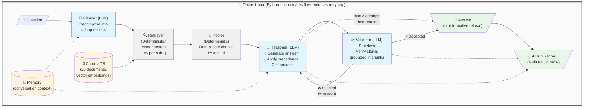

# Enterprise Knowledge Ops Agent

A production-grade retrieval-augmented generation (RAG) system demonstrating multi-agent orchestration, precedence-based reasoning, and grounding enforcement over a deliberately adversarial synthetic corpus.

**Not a production system.** All content is synthetic: placeholder carrier (Acme Mutual), fictional state (Meridian). Designed to fail in observable ways to validate retrieval and reasoning architecture.

## What This Is

This system answers questions about insurance claims procedures by:
1. **Decomposing** complex questions into searchable sub-questions
2. **Retrieving** relevant documents from a vector database
3. **Reasoning** over conflicting documents with explicit precedence rules
4. **Validating** every claim is grounded in retrieved evidence
5. **Retrying** when validation fails (max 2 attempts)
6. **Recording** complete audit trails for compliance and explainability

The corpus contains **6 deliberate traps** (version conflicts, supersessions, near-duplicates, unanswerable questions) to ensure the system handles edge cases correctly.

## Architecture

### Five Agents + Orchestrator

| Component | Type | Role |
|-----------|------|------|
| **Planner** | LLM | Decomposes questions into sub-questions if needed |
| **Retriever** | Deterministic | Executes vector search per sub-question (k=5) |
| **Pooler** | Deterministic | Deduplicates chunks, keeps highest scores |
| **Reasoner** | LLM | Generates answer applying precedence rules |
| **Validator** | LLM (stateless) | Verifies each claim is grounded in chunks |
| **Orchestrator** | Python | Coordinates flow, enforces retry cap, writes run records |

### Flow



**Legend:**
- 🧠 **Blue boxes** = LLM agents (Planner, Reasoner, Validator)
- **Gray boxes** = Deterministic components (Retriever, Pooler)
- 💾 **Yellow** = Data stores (Memory, ChromaDB)
- 💬 **Green** = Outputs (Answer, Run Record)
- **Solid arrows** = Main flow
- **Dashed arrows** = Data access
- **Retry loop** = Validator → Reasoner (max 2 attempts)

**Why LLMs for three agents:**
- **Planner**: Recognizing "how many days and at what rate" is two questions requires language understanding
- **Reasoner**: Extracting "$45 applies from 2026-05-01" requires reading prose, not regex
- **Validator**: Judging claim paraphrases requires semantic understanding

**What stays in code:** Date comparison, retry counting, chunk deduplication, similarity thresholds.

### Precedence Rules

Applied by Reasoner when documents conflict:

1. **Later effective_date wins** - Code compares dates, LLM decides which documents conflict
2. **More specific beats general** - LLM judgment
3. **Higher authority tier wins** - `policy > procedure > reference > comms`

Example: D4 (bulletin, 2026-05-01) supersedes C3 (limits schedule, 2025-07-01) on rental rates.

### Validation Design

The **Validator is deliberately stateless** - sees only current draft and chunks, no memory or attempt count. This prevents:
- Accepting on precedent rather than evidence
- Softening checks on later attempts (when answer is most doubtful)

Planner and Reasoner are generative (prior context helps); Validator is judicial (evaluates fixed artifacts).

## The Corpus

**20 synthetic insurance documents**, ~200 words each, organized in 4 groups:

- **Group A (5 docs)**: Policy documents - coverage definitions, state amendments
- **Group B (5 docs)**: Claims procedures - FNOL, assignment, valuation (multiple versions)
- **Group C (5 docs)**: Reference data - deductibles, rental limits, repair network rules
- **Group D (5 docs)**: Communications - FAQs, bulletins, escalation matrix

### Six Deliberate Traps

From `reference/CORPUS-MAP.md`:

1. **Version conflict**: B3 (75% threshold, 2026) vs B4 (70%, 2023) - only effective date distinguishes them
2. **Supersession**: D4 bulletin ($45/day, 2026-05-01) overrides C3 ($30/day, stale) - no cross-reference
3. **Unanswerable**: Diminished value appears nowhere - tests hallucination control
4. **Scope conflict**: C1 vs C4 on glass deductible - both true in different scopes
5. **State override**: A4 (Meridian: 100%) overrides B3 general rule (75%)
6. **Near-duplicate**: A1 (personal) vs A2 (fleet) - semantically close, factually different

**Design principle:** Human retrievers instinctively check dates, rank procedure over FAQ, and compare numbers. The agent pipeline must encode these instincts explicitly.

## Setup

**Prerequisites:**
- Python 3.11+
- AWS account with Bedrock access (Claude Sonnet 4.5)
- WSL Ubuntu (if on Windows)

**See [docs/SETUP.md](docs/SETUP.md)** for complete setup including:
- WSL installation
- AWS Bedrock configuration
- Python environment setup
- Automated script: `docs/setup.sh`

**First-time setup:**
```bash
# From project root
chmod +x docs/setup.sh
./docs/setup.sh

# The script creates .venv/ and sets environment variables in ~/.bashrc
# Open a new terminal OR reload the shell:
source ~/.bashrc
```

## Quick Start for Evaluators

**After completing setup** (see [docs/SETUP.md](docs/SETUP.md)):

### 1. Load environment
```bash
# Load Bedrock environment variables (if not in a fresh terminal)
source ~/.bashrc

# Activate Python virtual environment
source .venv/bin/activate
```

### 2. Verify connectivity
```bash
python test_bedrock.py
# Expected output: A response from Claude and a token count
```

### 3. Ingest corpus (one-time)
```bash
python -c "from src.ingestion import ingest; count = ingest('documents/'); print(f'Stored {count} chunks')"
# Expected output: Stored 20 chunks
```

**If re-ingesting:** Delete the vector database first to avoid duplicates:
```bash
rm -rf chroma_db/
```

### 4. Test the system with gate questions

**Q2 — Tests precedence** (should return $45/day from D4, not $30 from C3):
```bash
python -c "from src.agents import run_pipeline; print(run_pipeline('How many days of rental am I covered for and at what rate?'))"
```

**Q3 — Tests hallucination control** (should refuse with informative message - no corpus answer):
```bash
python -c "from src.agents import run_pipeline; print(run_pipeline('After my car is repaired, do you pay me for the lost resale value?'))"
```

**Q10 — Tests reasoning** (should conclude 200 < 250, no CAT procedures triggered):
```bash
python -c "from src.agents import run_pipeline; print(run_pipeline('We had a hailstorm damage 200 cars in our fleet. Does that trigger catastrophe procedures?'))"
```

### 5. Check audit trails
```bash
ls runs/  # Should show JSON run records from your test queries
cat evidence/README.md  # Shows execution statistics from 22 baseline runs
```

**Expected results:**
- **Q2**: Answer mentions "$45 per day" and "30 days", cites D4 and C3, applies precedence
- **Q3**: Refuses to answer, lists what was searched and retrieved, no fabrication
- **Q10**: Concludes "does not trigger catastrophe procedures" with arithmetic reasoning

See `evidence/README.md` for detailed expected outputs.

## Usage

### Full Agent Pipeline

**Recommended** - Complete multi-agent system with validation and audit trails:

```bash
python -c "from src.agents import run_pipeline; answer = run_pipeline('How many days of rental am I covered for and at what rate?'); print(answer)"
```

**Example questions:**
```bash
# Q2: Rental limits (tests precedence - D4 over C3)
python -c "from src.agents import run_pipeline; print(run_pipeline('How many days of rental am I covered for and at what rate?'))"

# Q3: Diminished value (tests hallucination control)
python -c "from src.agents import run_pipeline; print(run_pipeline('After my car is repaired, do you pay me for the lost resale value?'))"

# Q10: Hailstorm arithmetic (tests reasoning)
python -c "from src.agents import run_pipeline; print(run_pipeline('We had a hailstorm damage 200 cars in our fleet. Does that trigger catastrophe procedures?'))"
```

### Baseline RAG (Comparison)

**Simple single-pass RAG** - no validation, precedence, or retry:

```bash
python -m src.baseline "How many days of rental am I covered for and at what rate?"
```

Useful for demonstrating why the full pipeline is needed.

### Direct Retrieval (Debugging)

**Test retrieval only** - no LLM generation:

```bash
python -c "from src.retrieval import query; results = query('rental days covered', k=5); [print(f\"{r['doc_id']}: {r['score']:.4f}\") for r in results]"
```

## Evidence

**Complete execution records:** `evidence/README.md`

From 22 pipeline runs:
- **86% acceptance rate** (19/22 accepted on first or second attempt)
- **36% used precedence rules** (8/22 applied date-based or authority-tier precedence)
- **18% required retry** (4/22 needed 2 attempts due to validator rejection)

**Most common precedence rule:** `later_effective_date` (validates primary design goal - date-based supersession)

**Run records location:** `runs/` directory (gitignored)
- JSON files with complete audit trails
- Shows agent invocation order (US2 traceability)
- Captures precedence rules, attempts, failures
- Console summaries for human review

**Example precedence applications:**
- D4 over C3: Rental rate changed from $30 to $45 effective 2026-05-01
- B3 over B4: Total loss procedure version 4.0 (2026) supersedes version 3.2 (2023)
- B2 over C5: Normal contact timeline unless CAT declared

## Project Structure

```
.
├── documents/              # 20 synthetic corpus documents (A1-A5, B1-B5, C1-C5, D1-D5)
├── reference/              # Corpus map, question traces (NOT ingested)
├── specs/                  # Implementation specifications
│   ├── ingestion-spec.md   # Chunking, metadata extraction
│   ├── retrieval-spec.md   # Vector search, similarity scoring
│   ├── run-record.md       # Audit trail format
│   └── agent-spec.md       # Agent roles, orchestration, precedence rules
├── src/
│   ├── ingestion.py        # Load documents into ChromaDB
│   ├── retrieval.py        # Vector search with similarity floor
│   ├── run_record.py       # Audit trail builder
│   ├── baseline.py         # Naive single-pass RAG (comparison)
│   └── agents/             # Multi-agent pipeline
│       ├── planner.py      # Query decomposition
│       ├── pooling.py      # Chunk deduplication
│       ├── reasoner.py     # Answer generation + precedence
│       ├── validator.py    # Claim grounding check
│       ├── memory.py       # Context interface (deferred)
│       └── orchestrator.py # Main coordinator
├── runs/                   # Run records (gitignored except runs/evaluation/)
├── evidence/               # Summary of execution results
│   └── README.md           # Statistics and detailed record summaries
├── docs/                   # Setup documentation
│   ├── SETUP.md            # Human-readable setup guide
│   └── setup.sh            # Automated setup script
└── CLAUDE.md               # Guidance for Claude Code when working in this repo
```

## Key Design Decisions

From `specs/agent-spec.md`:

1. **Whole-document chunking**: Each document = 1 chunk (~200 words). Splitting would isolate cross-references and break precedence reasoning.

2. **Similarity floor (0.44)**: Empirically set to filter poor matches. Finding: Q3 (unanswerable) scored higher than Q7 (answerable), so floor alone cannot detect unanswerability - requires reasoning layer.

3. **k=5 per sub-question**: Balances recall (catching 3-doc questions) vs noise (avoiding D5 distractor).

4. **Max 2 attempts**: Retry loop with feedback. Validator rejection reason goes back to Reasoner. Detects repeated rejection (same reason twice = bug).

5. **Metadata preservation**: `effective_date`, `authority_tier` travel with chunks so Reasoner can apply precedence rules.

6. **No polishing pass**: Validated text displayed as-is to maintain grounding guarantee.

## Testing

**Gate tests (all passed):**

1. **Q2**: Returns $45/day (D4, effective 2026-05-01) not $30 (C3, superseded)
   - ✓ Precedence rule applied: `later_effective_date`
   - ✓ Run record shows D4 won over C3

2. **Q3**: Refuses with informative message (diminished value not in corpus)
   - ✓ No hallucination
   - ✓ Lists search terms and retrieved documents

3. **Q10**: Concludes 200 < 250, no CAT procedures triggered
   - ✓ Arithmetic reasoning works
   - ✓ Validator caught first attempt error, Reasoner corrected on retry

**See `evidence/README.md` for complete test results.**

## What This Demonstrates

**Production RAG requirements beyond simple retrieval-generation:**

1. **Grounding enforcement** - Validator ensures every claim is supported
2. **Precedence handling** - Explicit rules for conflicting documents
3. **Audit trails** - Complete run records for compliance (US3, US4, US6)
4. **Retry with feedback** - Iterative refinement when validation fails
5. **Failure detection** - Typed failures (insufficient_retrieval, retry_exhausted, etc.)
6. **Stateless validation** - Prevents weakening checks on later attempts

**Why baseline RAG isn't sufficient:**

Claude Sonnet 4.5 handles this corpus well even in single-pass mode (it can reason about dates when both documents are present). However, production systems need:
- Audit trails for compliance
- Systematic failure handling
- Explicit precedence tracking
- Validation and grounding enforcement
- Explainability (which rule applied, why)

## License

Synthetic test data only. Do not reuse corpus content as insurance guidance.

## References

- **Corpus design**: `reference/START-HERE.md`, `reference/CORPUS-MAP.md`
- **Test questions**: `reference/QUESTIONS-AND-TRACES.md`
- **Implementation specs**: `specs/*.md`
- **Setup guide**: `docs/SETUP.md`
- **Execution evidence**: `evidence/README.md`
- **Claude Code guidance**: `CLAUDE.md`
